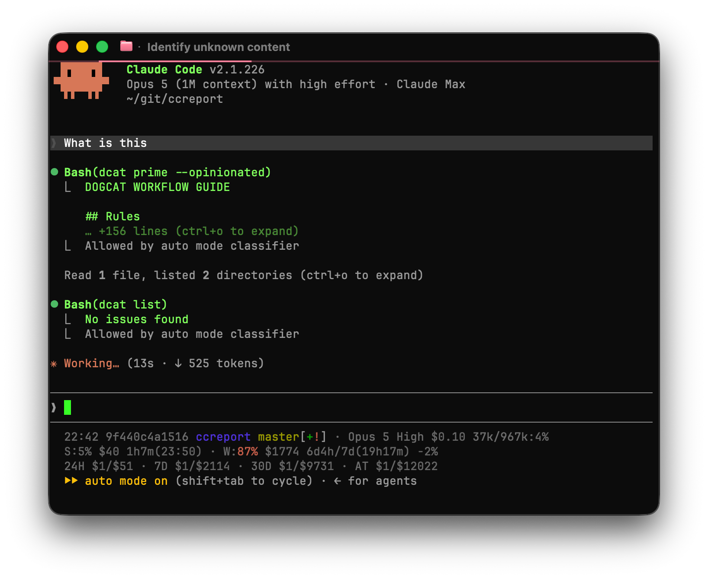
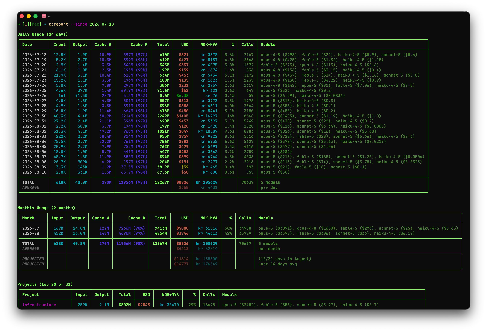
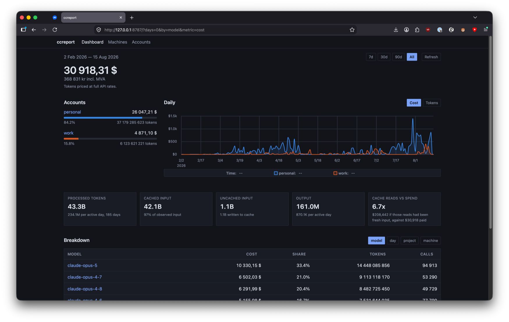

# ccreport

Token usage and cost reporting for Claude Code, a quota dashboard, and the
status line: three commands over one cache.

`ccreport` and the status line work off the JSONL session logs Claude Code
already writes under `~/.claude/projects/` (or `~/.config/claude/projects/`).

## Status line



Model, context fill, session and weekly quota, cost windows, git state.

Segments are toggled with `CLAUDE_STATUSLINE_*` environment variables, `1` on
and `0` off. The full list, with defaults, is the module docstring of
`src/ccreport/statusline.py`.

`bin/statusline-command_x.sh` reads each toggle as `${VAR:-default}`, so a
wrapper of your own that exports them and hands over wins. Keep it outside the
checkout and your settings survive every `git pull`:

```bash
#!/usr/bin/env bash
# ~/.claude/statusline-wrapper.sh — chmod +x

export CLAUDE_STATUSLINE_HOSTNAME=1
export CLAUDE_STATUSLINE_DOGCAT=1
export CLAUDE_STATUSLINE_SCOPED_MODE=always

# "$@" carries the arguments Claude Code passes; the JSON arrives on stdin,
# which exec leaves alone.
exec bash /path/to/ccreport/bin/statusline-command_x.sh "$@"
```

Point Claude Code's `settings.json` at that wrapper:

```json
{
  "statusLine": {
    "type": "command",
    "command": "bash /path/to/statusline-wrapper.sh"
  }
}
```

The status line imports nothing outside the stdlib, so any `python3` runs it;
it works before `uv sync` has. Quota percentages are refreshed by a detached
process, so a fresh reading lands on a later render.

### The hooks

Two per-session files under `TMPDIR` hold what a render learned, and two hooks
drop them when what they hold has changed. Both need `jq`:

```json
{
  "hooks": {
    "SessionStart": [
      {
        "hooks": [
          {
            "type": "command",
            "command": "bash /path/to/ccreport/bin/clear-statusline-memo.sh"
          }
        ]
      }
    ],
    "ConfigChange": [
      {
        "hooks": [
          {
            "type": "command",
            "command": "bash /path/to/ccreport/bin/clear-statusline-cache.sh"
          }
        ]
      }
    ]
  }
}
```

`clear-statusline-memo.sh` deletes the memo, whose
`--dangerously-skip-permissions` verdict comes from the argv of the claude
process that launched the session id. `--resume` reuses that id under new argv,
and `SessionStart` takes no matcher — it fires on startup, resume, clear,
compact and fork alike, which is every moment that verdict can change.

`clear-statusline-cache.sh` deletes the fetch cache, which holds the `sbx`/`!sbx`
badge and the segments the `CLAUDE_CODE_STATUSLINE_*` toggles switch on for 15
seconds. Both are read out of settings files, so `ConfigChange` is what puts an
edit on the next render rather than 15 seconds later. It leaves the memo in
place: the DSP verdict is not a settings reading.

Neither hook prints anything — a `SessionStart` hook's stdout is appended to the
session's context — and both exit 0 on anything they cannot parse. Exit 0 does
double duty in the `ConfigChange` one: exit 2 there blocks the settings change
itself.

## ccreport



```bash
ccreport                                    # every report, all history
ccreport daily --since 20260201 --breakdown
ccreport monthly
ccreport project --limit 10
ccreport session --limit 10
ccreport limits -w session                  # rate-limit window history
```

Costs are priced per record from a pricing table in `src/ccreport/pricing.py`,
deduplicated by the log's own `message.id`/`requestId`, and grouped into
projects by git remote, then repo-root path, then directory name. A rename the
rules cannot see needs a manual rule:

```bash
ccreport overrides
ccreport merge company company-platform  # company's records report as company-platform
ccreport unmerge company
```

## ccu

The quota dashboard, the same numbers as Claude Code's `/usage` screen, from
the same endpoint, cached for up to ten minutes:

```bash
ccu             # session, week, per-model and Extra quotas
ccu --force     # bypass the 10-minute cache
ccu --json      # the raw API body, unrendered; always a live fetch, never cached
```

The week gets a pace line comparing usage against elapsed time.
`CLAUDE_CODE_PACE_DAYS` sets the day the quota is meant to be gone by, counting
from whichever weekday the window starts on. It defaults to 7, and both this
and the status line's pace segment answer to it.

## The dashboard



One machine runs a server and every machine pushes its records to it, so the
dashboard reports spend across all of them. The server prices each record with
its own copy of the pricing table rather than trusting what arrived.

```bash
just serve      # http://127.0.0.1:8787
```

`CCREPORT_SERVER_DB`, `_HOST`, `_PORT`, `_NETWORKS` and `_MAX_BODY` configure
it; there is no config file. `_NETWORKS` defaults to loopback and gates the web
UI alone — a machine pushes from wherever it happens to be, and its token is
what admits it.

Mint a token under `/settings/machines`. That page shows it once, inside the
command that consumes it:

```bash
ccreport server connect http://host:8787 --token TOKEN
ccreport server status                      # what each server knows this machine as
ccreport server push                        # the status line also pushes on its own interval
ccreport --server http://host:8787          # the merged reports, in the terminal
```

The token and the push policy land in `~/.config/ccreport/push.toml` at mode
0600. `--opt-in-repos work,ccreport` restricts that policy to the named
projects: every other project still sends its counts, but its name, session,
cwd and repo are stripped before the push and report as one aggregated row per
account.

## Install

```bash
git clone git@github.com:oroddlokken/ccreport.git && cd ccreport
uv sync
```

Then put `bin/` on `PATH`, or install the CLI on its own:

```bash
uv tool install .
```

Every wrapper in `bin/` runs the modules out of the checkout rather than an
installed copy, so an edit takes effect on the next invocation.

## Updates

There are no tagged versions. master is the release, so updating is a
fast-forward in the checkout:

```
ccreport update           # how far behind master is this checkout?
ccreport update --pull    # fast-forward it
```

Both run from any directory — the checkout is found from where the package is
installed, not from your cwd. The check is live, and `--pull` runs
`git pull --ff-only`, so a checkout with commits of its own is left alone.

The status line says when that is worth doing, on a line under the cost
windows:

```
↑ A newer version of ccreport is available, run 'ccreport update --pull' to update
```

Twice a day a detached process asks GitHub's API how far origin's master has
moved past your HEAD. It reads `.git` as files and writes nothing there — no
fetch, no refs touched — and the request never happens on the render path. Set
`CLAUDE_STATUSLINE_UPDATE=0` to turn the line and the request off. An installed
copy with no checkout beside it never checks at all.

The line goes quiet the moment you pull, rather than waiting for the next
check: the stored count is tied to the commit it was measured against.

## Where the data lives

| Path | What |
|---|---|
| `~/.cache/ccreport/cache.db` | Parsed records, costs, usage row, rate-limit samples |
| `~/.local/share/ccreport/snapshots/` | One daily copy of the above, 14 kept |
| `~/.config/ccreport/ccreport.toml` | Optional `repo_roots` for project grouping |

Snapshots survive a `~/.cache` wipe.

These three used to live under `macsetup/claude` names. Any command migrates
them for itself on the first run that finds the old cache:

```bash
ccreport migrate --dry-run
ccreport migrate
```

## Development

`just --list` prints every recipe. `just test` runs the suite, `just lint-all`
runs ruff and pyright, `just fmt` applies ruff's autofixes but deliberately not
`ruff format`; see `AGENTS.md` for why.

Detailed calculations, cache schema and the reasoning behind the cost windows:
`docs/calculation-reference.md`.
